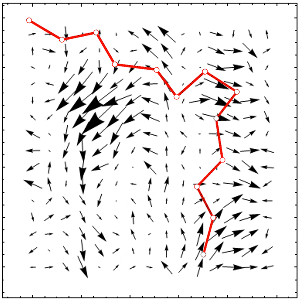

# Simulation engine for polymeric chain driven by Spatially Correlated Noise (SCN)
## Description
This is a simulation engine for 2D polymeric chain, driven by SCN. Initially created for my MSc thesis and further developed for my early PhD, I worked on it somwhere bewteen 2010 and 2012. It was used in my research on the role of SCN in physical systems. The results generated with this code were discussed in a few of my publications[^1][^2][^3][^4], where you can find details about the physical and mathematical context.

The code simulates the following physical situation:

Here, the red line is our polymeric chain and the arrows in the background are the snapshot of SCN vectors. Notice, that vectors close to each other (within certain 'correlation length') are 'similar' in direction and length. This is different from the non-correlated noise, for which the relative direction of two nearby vectors would be completely random. In order to simulate this system, the following components had to be implemented into to the code:

* Structures describing the polymer state and physical variables
* Matrix operations for generating SCN
* Methods for integrating the equations of motion
* Animations
* Interface for outputing data

[^1]: [M. Majka, P. F. Góra, ‘Polymer shape dynamics induced by spatially correlated noise’, Acta Phys. Pol. B, 43, 5, 1133 (2012)](http://web.a.ebscohost.com/abstract?direct=true&profile=ehost&scope=site&authtype=crawler&jrnl=05874254&AN=76482102&h=vQ3WB8hyb8pdYjbzvsWv6OdyFnl8cFEkHO4%2fiukVCmHp2kiWxuROMt1ic8rpbZa3Q6BHTSnrsCmEe0WrQGIN%2bw%3d%3d&crl=c&resultNs=AdminWebAuth&resultLocal=ErrCrlNotAuth&crlhashurl=login.aspx%3fdirect%3dtrue%26profile%3dehost%26scope%3dsite%26authtype%3dcrawler%26jrnl%3d05874254%26AN%3d76482102)
[^2]: [M. Majka, P. F. Góra, ‘Polymer unfolding and motion synchronization induced by spatially correlated noise’, Phys. Rev. E,  86, 5, 051122 (2012)](https://journals.aps.org/pre/abstract/10.1103/PhysRevE.86.051122)
[^3]: [M. Majka, P. F. Góra, ‘Reinterpreting polymer unfolding effect induced by spatially correlated noise’, Acta Phys. Pol. B, 44, 5, 1099 (2013)](http://web.b.ebscohost.com/abstract?direct=true&profile=ehost&scope=site&authtype=crawler&jrnl=05874254&AN=88950514&h=7nct0WEPBJizKrO%2bYcidZI9vaBcNfhMMJPYjkNehyxDOkct7sWinj24GCBrPEpSJoGsvgW5%2bvsfLYOr4WYFhxA%3d%3d&crl=c&resultNs=AdminWebAuth&resultLocal=ErrCrlNotAuth&crlhashurl=login.aspx%3fdirect%3dtrue%26profile%3dehost%26scope%3dsite%26authtype%3dcrawler%26jrnl%3d05874254%26AN%3d88950514)
[^4]: [M. Majka, P. F. Góra, ‘Non-Gaussian polymers described by alpha-stable chain statistics: model, effective interactions in binary mixtures and application to on-surface separation’, Phys. Rev. E, 91, 5, 052602 (2015)](https://journals.aps.org/pre/abstract/10.1103/PhysRevE.91.052602)
